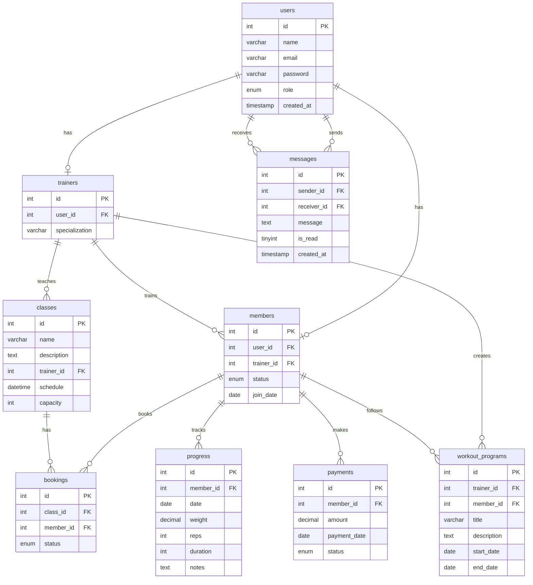

# 💪 MachoGym — Sistem Manajemen Gym

<div align="center">

**Aplikasi web manajemen gym full-stack dengan sistem multi-role (Admin, Trainer, Member).**  
Dibangun dengan Native PHP, MySQL, dan antarmuka modern berbasis glassmorphism.


</div>

---

## 📋 Deskripsi

**MachoGym** adalah sistem manajemen gym berbasis web yang dirancang untuk mengelola operasional gym secara efisien. Aplikasi ini mendukung tiga peran pengguna — **Admin**, **Trainer**, dan **Member** — masing-masing dengan dashboard dan fitur yang disesuaikan. Dibangun menggunakan arsitektur MVC sederhana dengan Native PHP dan MySQL.

---

## ✨ Fitur Utama

### 🔐 Autentikasi & Otorisasi
- Login & Register dengan validasi
- Role-based access control (Admin / Trainer / Member)
- Proteksi route berdasarkan peran pengguna
- Session management

### 👑 Dashboard Admin
- **Manajemen Member** — Aktivasi, blokir, hapus, dan kelola data member
- **Manajemen Trainer** — Tambah, edit, dan hapus data trainer
- **Manajemen Kelas** — Buat dan kelola jadwal kelas gym
- **Verifikasi Pembayaran** — Approval pembayaran membership dari member

### 🏋️ Dashboard Trainer
- **Daftar Member** — Lihat member yang ditangani
- **Program Latihan** — Buat dan kelola program workout untuk member
- **Chat Real-time** — Komunikasi langsung dengan member via AJAX

### 🧑‍💻 Dashboard Member
- **Booking Kelas** — Pesan kelas yang tersedia
- **Tracking Progress** — Catat dan pantau perkembangan latihan dengan grafik
- **Pembayaran** — Upload bukti pembayaran membership
- **Chat dengan Trainer** — Tanya jawab langsung dengan trainer

### 💬 Sistem Chat
- Real-time messaging via AJAX polling
- Komunikasi dua arah antara Trainer dan Member

---

## 🛠️ Tech Stack

| Layer        | Teknologi                                    |
|:-------------|:---------------------------------------------|
| **Backend**  | PHP 8.x (Native, tanpa framework)            |
| **Database** | MySQL 8.0                                    |
| **Frontend** | HTML5, CSS3 (Glassmorphism), Vanilla JS       |
| **Icons**    | Font Awesome 6.x                             |
| **Mail**     | PHPMailer 7.x (via Composer)                 |
| **Server**   | XAMPP (Apache + MySQL)                       |

---

## 📁 Struktur Proyek

```
gym_management/
├── assets/
│   ├── css/
│   │   ├── style.css            # Styling halaman publik (landing, auth)
│   │   └── dashboard.css        # Styling dashboard (admin, trainer, member)
│   ├── img/                     # Gambar & aset media
│   ├── js/
│   │   └── main.js              # Script JavaScript utama
│   └── uploads/                 # Upload file (bukti pembayaran, dll)
├── config/
│   └── database.php             # Konfigurasi koneksi database (PDO)
├── controllers/
│   ├── AdminMemberController.php   # Aksi admin terhadap member
│   ├── AuthController.php          # Login, register, logout
│   ├── MemberClassController.php   # Booking kelas oleh member
│   ├── MessageController.php       # API chat (AJAX)
│   └── PaymentController.php       # Proses pembayaran
├── database/
│   └── gym_db.sql               # Schema database + data dummy
├── models/
│   └── User.php                 # Model user
├── views/
│   ├── admin/
│   │   ├── dashboard.php        # Dashboard admin
│   │   ├── members.php          # Manajemen member
│   │   ├── trainers.php         # Manajemen trainer
│   │   ├── classes.php          # Manajemen kelas
│   │   └── non_member_payments.php  # Verifikasi pembayaran
│   ├── auth/
│   │   ├── login.php            # Halaman login
│   │   └── register.php         # Halaman registrasi
│   ├── chat/
│   │   └── index.php            # Halaman chat
│   ├── home/
│   │   └── landing.php          # Landing page publik
│   ├── layouts/
│   │   ├── header.php           # Header dashboard
│   │   ├── sidebar.php          # Sidebar navigasi dashboard
│   │   └── footer.php           # Footer dashboard
│   ├── member/
│   │   ├── dashboard.php        # Dashboard member
│   │   ├── classes.php          # Daftar & booking kelas
│   │   ├── progress.php         # Tracking progress latihan
│   │   └── payment.php          # Halaman pembayaran
│   └── trainer/
│       ├── dashboard.php        # Dashboard trainer
│       ├── members.php          # Daftar member binaan
│       └── programs.php         # Program latihan
├── vendor/                      # Dependencies (Composer)
├── composer.json                # Konfigurasi Composer
├── gym_db.sql                   # Backup schema database
├── index.php                    # Entry point & router utama
└── README.md
```

---

## 🚀 Instalasi & Setup

### Prasyarat

- [XAMPP](https://www.apachefriends.org/) (PHP 8.x + MySQL)
- [Composer](https://getcomposer.org/) (untuk dependency PHPMailer)
- Web Browser modern (Chrome, Firefox, Edge)

### Langkah Instalasi

**1. Clone Repository**

```bash
git clone https://github.com/raflyirhandy/Gym-Apps.git
```

**2. Pindahkan ke Direktori XAMPP**

Salin folder project ke dalam direktori `htdocs` XAMPP:

```
C:\xampp\htdocs\gym_management\
```

**3. Install Dependencies**

```bash
cd C:\xampp\htdocs\gym_management
composer install
```

**4. Buat Database**

- Buka **phpMyAdmin** → `http://localhost/phpmyadmin`
- Buat database baru dengan nama: `gym_db`
- Import file SQL:
  - Pilih tab **Import**
  - Upload file `database/gym_db.sql`
  - Klik **Go / Kirim**

**5. Konfigurasi Database**

Pastikan konfigurasi di `config/database.php` sesuai dengan environment Anda:

```php
private $host     = "localhost";
private $db_name  = "gym_db";
private $username = "root";
private $password = "";
```

**6. Jalankan Aplikasi**

- Nyalakan **Apache** dan **MySQL** di XAMPP Control Panel
- Buka browser dan akses:

```
http://localhost/gym_management/
```

---

## 🔑 Akun Default

Semua akun menggunakan password: **`password123`**

| Role      | Email               | Nama           |
|:----------|:--------------------|:---------------|
| 🛡️ Admin   | `admin@gym.com`     | Admin Utama    |
| 🏋️ Trainer | `trainer1@gym.com`  | Trainer Budi   |
| 🏋️ Trainer | `trainer2@gym.com`  | Trainer Siti   |
| 👤 Member  | `member1@gym.com`   | Member Andi    |
| 👤 Member  | `member2@gym.com`   | Member Caca    |
| 👤 Member  | `member3@gym.com`   | Member Doni    |

---

## 🗄️ Skema Database



---

## 📄 Lisensi

Project ini dibuat untuk keperluan pembelajaran dan portofolio.

© 2026 **Macho Gym System** by **Rafly**.

---

<div align="center">

**⭐ Jangan lupa beri star jika project ini bermanfaat! ⭐**

</div>
